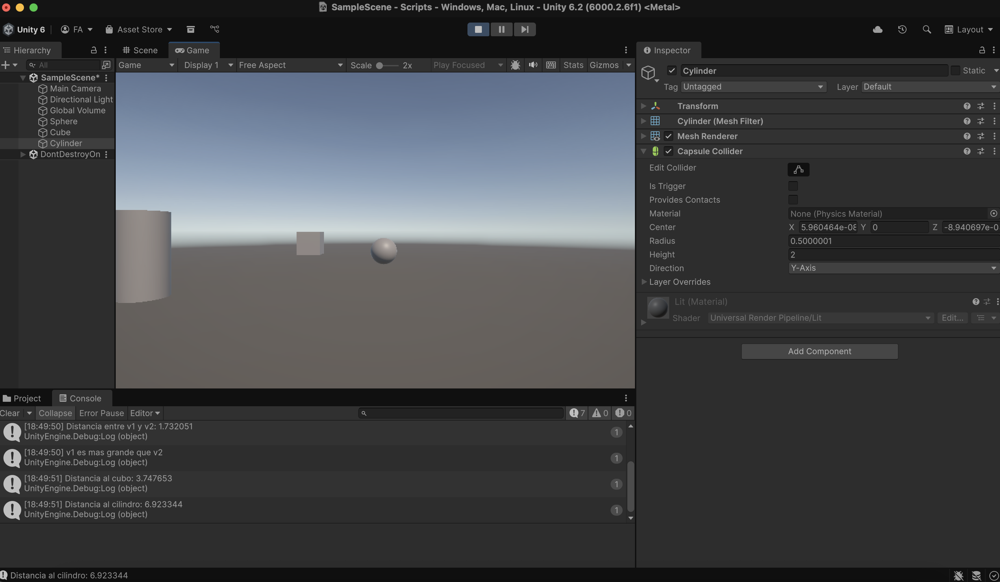

# IntroduccionC-Scripts
Ejercicios relacionados con la **segunda práctica** de Interfaces Inteligentes 👨🏻‍💻

1. Crea un script asociado a un objeto en la escena que inicialice un vector de 3 posiciones con valores entre 0.0 y 1.0, para tomarlo como un vector de color (Color). Cada 120 frames se debe cambiar el valor de una posición aleatoria y asignar el nuevo color al objeto. Parametrizar la cantidad de frames de espera para poderlo cambiar desde el inspector.

https://github.com/user-attachments/assets/f84d09e4-162b-4c96-8e67-e5d2ac3dc65a

**Script relacionado** -> [randomColor.cs](./scripts/randomColor.cs)

2. Crea un script asociado a la esfera con dos variables Vector3 públicas. Dale valor a cada componente de los vectores desde el inspector. Muestra en la consola:

- **Magnitud de cada vector:** Muestra la magnitud de ambos vectores.
- **Ángulo entre los vectores:** Calcula y muestra el ángulo que forman.
- **Distancia entre los vectores:** Indica la distancia entre ambos.
- **Comparación de altura:** Muestra un mensaje indicando cuál de los dos vectores tiene una componente Y (altura) mayor.

https://github.com/user-attachments/assets/25b1e7b5-2733-4473-bb53-646211cfab31

**Script relacionado** -> [vector3.cs](./scripts/vector3.cs)

3. Muestra en pantalla el vector con la posición de la esfera.

https://github.com/user-attachments/assets/634ebe29-ed5c-4ef5-8c6d-6c95eed820c1

**Script relacionado** -> [posicionEsfera.cs](./scripts/posicionEsfera.cs)

4. Crea un script para la esfera que muestre en consola la distancia a la que están el cubo y el cilindro.

**Script relacionado** -> [distanciaCuboCilindro.cs](./scripts/distanciaCuboCilidro.cs)

5. Selecciona tres posiciones en tu escena a través de un objeto invisible (marcador) que incluya 3 vectores numéricos para configurar posiciones en las que quieres ubicar los objetos en respuesta a pulsar la barra espaciadora. Estos vectores representan un desplazamiento respecto a la posición original de cada objeto. Crea un script que ubique en las posiciones configuradas cuando el usuario pulse la barra espaciadora.

https://github.com/user-attachments/assets/f372c8d3-dcc2-4d11-8935-719c86b4813a

**Script relacionado** -> [moverAPosicion.cs](./scripts/moverAPosicion.cs)

6. Agrega un campo velocidad a un cubo y asígnale un valor que se pueda cambiar en el inspector de objetos. Muestra la consola el resultado de multiplicar la velocidad por el valor del eje vertical y por el valor del eje horizontal cada vez que se pulsan las teclas flecha arriba-abajo ó flecha izquierda-derecha. El mensaje debe comenzar por el nombre de la flecha pulsada.

https://github.com/user-attachments/assets/0a97ec19-dc17-402d-8cab-7248e42cc944

**Script relacionado** -> [campoVelocidad.cs](./scripts/campoVelocidad.cs)

7. Mapea la tecla H a la función disparo.

8. Crea un script asociado al cubo que en cada iteración traslade al cubo una cantidad proporcional un vector que indica la dirección del movimiento: moveDirection que debe poder modificarse en el inspector.  La velocidad a la que se produce el movimiento también se especifica en el inspector, con la propiedad speed. Inicialmente la velocidad debe ser mayor que 1 y el cubo estar en una posición y=0. En el informe de la práctica comenta los resultados que obtienes en cada una de las siguientes situaciones:

- Duplicas las coordenadas de la dirección del movimiento.

https://github.com/user-attachments/assets/be7b7fe4-d077-420e-ac4b-8073c332c240

- Duplicas la velocidad manteniendo la dirección del movimiento.

https://github.com/user-attachments/assets/d99de61c-972a-4134-a07b-383a5ef0ffd7

- La velocidad que usas es menor que 1

https://github.com/user-attachments/assets/1f5dbed5-ca07-4025-bdb1-295382af554b

- La posición del cubo tiene y>0

https://github.com/user-attachments/assets/12f05a99-afdb-46db-b261-9843b36b35c8

- Intercambiar movimiento relativo al sistema de referencia local y el mundial.

**Script relacionado** -> [moverCubo.cs](./scripts/moverCubo.cs)

9. y 10. Mueve el cubo con las teclas de flecha arriba-abajo, izquierda-derecha a la velocidad speed. Cada uno de estos ejes implican desplazamientos en el eje vertical y horizontal respectivamente. Mueve la esfera con las teclas w-s (movimiento vertical) a-d (movimiento horizontal).

https://github.com/user-attachments/assets/57dca09a-1663-4ba7-a273-cd96625108e2

**Scripts relacionados** -> [moverConTeclasEsfera.cs](./scripts/moverConTeclasEsfera.cs) y [moverConFlechasCubo](./scripts/moverConTeclasEsfera.cs)

11. Adapta el movimiento en el ejercicio 5 para que el cubo se mueva hacia la posición de la esfera. Debes considerar que el avance no debe estar influenciado por cuánto de lejos o cerca estén los dos objetos. 

https://github.com/user-attachments/assets/52b549c3-7fda-4ff1-b4aa-d043dd7f496d

**Script relacionado** -> [moverCuboAEsfera.cs](./scripts/moverCuboAEsfera.cs)

12. Adapta el movimiento en el ejercicio 6 de forma que el cubo gire hacia la esfera. Realiza pruebas cambiando la posición de la esfera mediante las teclas awsd

https://github.com/user-attachments/assets/ae1add79-4b26-43ce-a09c-bb9abec48dfb

**Script relacionado** -> [rotarCuboAEsfera.cs](./scripts/rotarCuboAesfera.cs)
